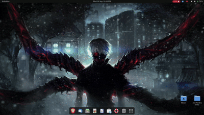
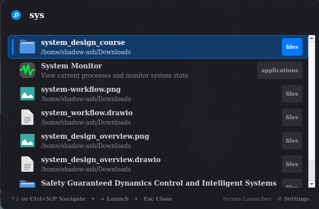
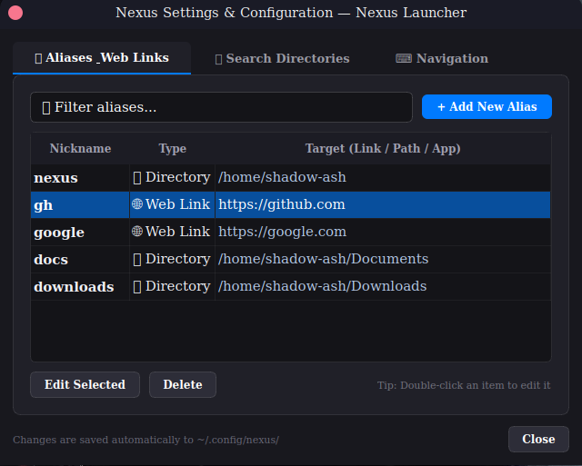
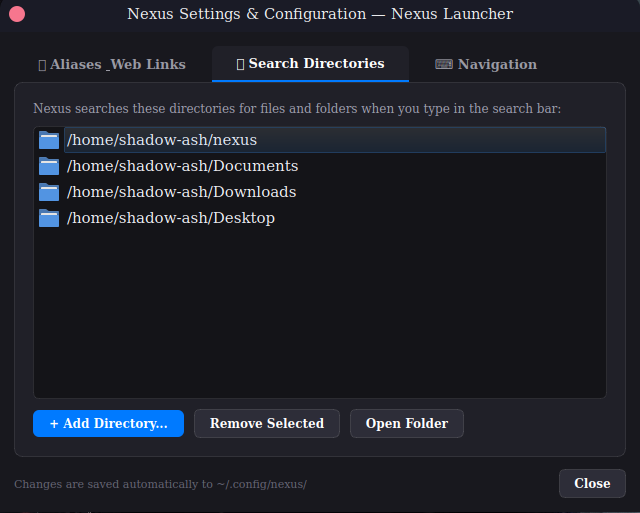
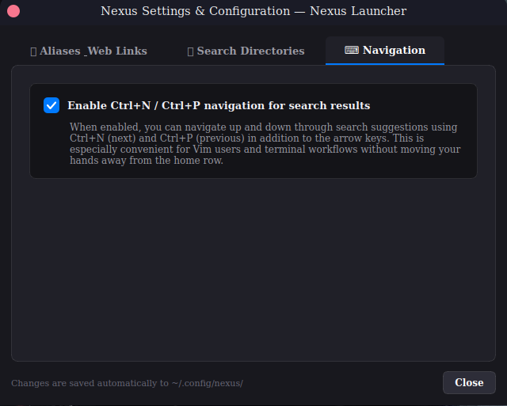

# Nexus

A fast, keyboard-first productivity launcher for Linux.

Press `Alt + Space`, type, press Enter. Nexus finds applications, evaluates expressions, opens files and folders, runs shell commands, and resolves your own aliases — from one window, without touching the mouse.

> **Version 0.1.0 — early release.** Nexus is usable daily on X11 and is the author's primary launcher. It is not feature-complete: the plugin system, web search, and clipboard history are not built yet, and Wayland is not supported. See [Not implemented yet](#not-implemented-yet) before installing.



<table>
  <tr>
    <td align="center">
      <br>
    </td>
    <td align="center">
      <br>
    </td>
  </tr>
  <tr>
    <td align="center">
      <br>
    </td>
    <td align="center">
      <br>
    </td>
  </tr>
</table>


## Why this exists

A Linux desktop scatters simple actions across separate tools: an application menu to launch things, a file manager to find things, a terminal to run things, a browser to look things up, a calculator for arithmetic. Each one costs a context switch.

Nexus collapses those into a single keystroke. It is built around four ideas:

- **Speed is a feature.** A launcher that takes 300 ms to appear is a launcher you stop using.
- **Local-first.** Everything works offline. No account, no telemetry, no network calls unless a provider explicitly makes one.
- **Separation of retrieval and ranking.** Providers find candidates; a separate ranking engine decides the order. Adding a source never means touching ranking logic.
- **No AI for its own sake.** Lexical search is the foundation. Semantic search is a later, optional, measured addition — not a headline.


## What works today

| Feature | How to use it |
|---|---|
| Application search | Type any part of a name, generic name, keyword or comment |
| Fuzzy matching | `vsc` → Visual Studio Code |
| Usage-aware ranking | Frequently launched apps rise over time |
| Calculator | `calc 125 * 37`, `calc sqrt(144)`, `calc 2^10`, or type a bare expression |
| File & folder search | `file thesis.pdf` searches your configured directories |
| Shell commands | `> docker ps` — the `>` prefix is required, never implicit |
| Aliases | `alias gh https://github.com`, then type `gh` |
| Settings | Type `settings`, or run `nexus settings` |
| Tray icon | Toggle, open settings, rebuild index, quit |
| Single instance | Launching Nexus again toggles the running window instead of starting a second copy |

**Keys**

```
Alt + Space     Show / hide the launcher
↑ / ↓           Navigate results
Ctrl + N / P    Navigate results (optional, on by default)
Enter           Execute the selected result
Esc             Close
```


## Not implemented yet

Listed honestly so you know what you are getting. These are planned — see the [roadmap](#roadmap).

- **Plugin system.** All providers are compiled into the core. There is no public API and no way to extend Nexus without editing it.
- **Web search.** The `web ` prefix is parsed but no provider handles it yet, so it returns nothing.
- **Clipboard history.** Same — `clip ` is parsed but unimplemented.
- **System actions.** No shutdown, lock, logout or sleep entries.
- **URL handling.** Pasting a bare URL does nothing unless you have made an alias for it.
- **Wayland.** The global hotkey uses an X11 key grab. Under a Wayland session it will silently fail. See [Wayland](#wayland).
- **Configurable shortcut.** `Alt + Space` is currently hardcoded.
- **Themes.** Dark only.
- **File index.** File search walks the filesystem live rather than using an index, so it is only enabled behind the explicit `file ` prefix.
- **History controls.** Usage and query history are recorded locally with no way to disable or clear them yet. Nothing leaves your machine; you can delete the database manually (see [Where your data lives](#where-your-data-lives)).
- **Unit conversion.** The calculator does arithmetic and functions only — no `120 km in miles`.


## Requirements

- Linux, **X11 session** (see [Wayland](#wayland))
- CMake 3.22 or newer
- A C++20 compiler (GCC 11+ or Clang 14+)
- Qt — `Core`, `Gui`, `Widgets`, `Network`. Developed and tested against **Qt 5.15.3**. Qt 6 builds successfully and is covered by CI, but has had far less real-world testing — see [Known Qt6 differences](#known-qt6-differences) if you hit anything.
- SQLite 3 development headers
- libX11 development headers

**Debian / Ubuntu**

```bash
sudo apt install build-essential cmake \
  qt6-base-dev libsqlite3-dev libx11-dev
```

**Fedora**

```bash
sudo dnf install gcc-c++ cmake \
  qt6-qtbase-devel sqlite-devel libX11-devel
```

**Arch**

```bash
sudo pacman -S base-devel cmake qt6-base sqlite libx11
```


## Build

```bash
git clone https://github.com/mawaissaleem/Nexus.git
cd Nexus
cmake -B build -DCMAKE_BUILD_TYPE=Release
cmake --build build -j$(nproc)
```

The binary lands at `build/nexus`.

**Run it**

```bash
./build/nexus
```

Nexus starts in the background, registers the hotkey, and shows the window once so you know it is alive. Press `Alt + Space` from anywhere after that.

**Install system-wide**

```bash
sudo install -Dm755 build/nexus /usr/local/bin/nexus
```

**Start on login**

There is no packaged service unit yet. Add `/usr/local/bin/nexus` to your desktop environment's startup applications, or write a user unit:

```ini
# ~/.config/systemd/user/nexus.service
[Unit]
Description=Nexus Launcher
After=graphical-session.target

[Service]
ExecStart=/usr/local/bin/nexus
Restart=on-failure

[Install]
WantedBy=graphical-session.target
```

```bash
systemctl --user enable --now nexus
```


## Command line

Nexus is usable without the GUI, which also makes it scriptable and bindable to your own WM shortcut.

```
nexus                     Start in the background, or toggle a running instance
nexus --toggle            Toggle the window (bind this to your own hotkey)
nexus --show              Show the window on the active monitor
nexus --hide              Hide the window
nexus settings            Open the settings dialog
nexus --rebuild-index     Rescan .desktop directories and rebuild the app index
nexus --list-apps         Print every indexed application
nexus query <term>        Run one search and print ranked results with latency
nexus --help              Full usage
```

**Search directories**

```bash
nexus dir add ~/Documents
nexus dir add ~/projects
nexus dir list
nexus dir remove ~/Documents
```

**Aliases**

```bash
nexus alias add gh https://github.com
nexus alias add dl ~/Downloads
nexus alias list
nexus alias remove gh
```

Aliases resolve to URLs, directories, files or commands; the type is detected from the target.


## Wayland

The global hotkey is implemented as an X11 `XGrabKey` on the root window. Under a Wayland session this will not receive key events and **the hotkey will silently do nothing**.

Nexus itself runs fine under XWayland. Until a portal-based implementation lands, bind the toggle yourself through your compositor's own shortcut settings:

```
Command: nexus --toggle
```

GNOME: Settings → Keyboard → Custom Shortcuts. KDE: System Settings → Shortcuts → Custom Shortcuts.

## Known Qt6 differences

Nexus targets Qt 5.15.3 in day-to-day development. CI builds against Qt 6 to catch API drift early, but Qt6 has not had the same hours of real usage as Qt5. One signature change has already surfaced and been fixed (`QWidget::enterEvent` takes `QEnterEvent*` in Qt6 vs `QEvent*` in Qt5 — handled with a `QT_VERSION_CHECK` guard in `settings_dialog.cpp`). If you build against Qt6 and something behaves differently from what's described here, please open an issue.

## Where your data lives

Everything stays on your machine. Nexus makes no network requests and requires no account.

```
~/.local/share/nexus/nexus.db     Application index, usage events, query history
~/.config/nexus/config.json       Search directories, aliases, navigation settings
```

Both honour `XDG_DATA_HOME` and `XDG_CONFIG_HOME`. To wipe all history, delete `nexus.db` — it will be rebuilt on next launch. A proper clear-history command is planned for 0.3.0.


## Architecture

```
                      ┌──────────────────┐
                      │   Qt Launcher    │
                      └────────┬─────────┘
                               ▼
                      ┌──────────────────┐
                      │  Search Engine   │──► Ranking Engine
                      └────────┬─────────┘
          ┌──────────┬─────────┼─────────┬──────────┐
          ▼          ▼         ▼         ▼          ▼
       Alias       Apps      Files     Calc      Shell
                     │
                     ▼
              ┌─────────────┐
              │   SQLite    │
              └─────────────┘
```

```
include/nexus/ , src/
├── core/        Query parsing, search engine, ranking, executor, config, aliases
├── index/       Desktop-entry parsing, application indexer, SQLite layer
├── providers/   Application, file, calculator, shell, alias
├── ui/          Launcher window, result widget, settings dialog, X11 hotkey
└── utils/       Fuzzy matcher, logger
```

Two rules hold throughout: the core never depends on Qt, and OS-level calls are confined to `Executor`. Every provider implements `ISearchProvider` and returns the same `SearchResult`, so the UI never needs to know where a result came from.

**Search flow.** `Query` classifies the input by prefix (`>`, `calc `, `file `) and normalises it without destroying syntax-sensitive text. `SearchEngine` fans out to providers in priority order, catching exceptions per provider so one bad source cannot take down the window. `RankingEngine` then rescores everything with exact-match, prefix, token and usage signals, and sorts.


## Tests

```bash
cmake -B build -DCMAKE_BUILD_TYPE=Debug
cmake --build build -j$(nproc)
ctest --test-dir build --output-on-failure
```

Eight suites cover fuzzy matching, desktop-entry parsing, ranking, the calculator, the database layer, aliases, file search and configuration. Integration and performance suites are planned for 0.2.0.


## Roadmap

| Version | Focus |
|---|---|
| **0.1.0** | This release: apps, calculator, shell, files, aliases on X11 |
| 0.2.0 | Search off the UI thread, real file index with inotify, schema migrations, published benchmarks |
| 0.3.0 | Configurable shortcut, themes, full settings coverage, history controls, query-aware ranking |
| 0.4.0 | Plugin API, discovery, lifecycle and isolation; web, clipboard and system actions built as plugins |
| 0.5.0 | Wayland support, packaging, tested across GNOME / KDE / XFCE |
| 1.0.0 | Stable plugin API, accessibility, security review |

The full specification lives in [`nexus-SRS.md`](nexus-SRS.md).


## Security notes

Nexus can launch processes, so a few things are deliberate:

- Shell execution requires the explicit `>` prefix. A normal search will never run a command, no matter what you type.
- The calculator is a hand-written recursive-descent parser. It does not call an interpreter or a shell.
- No network access, no telemetry, no analytics endpoint.

Known gaps at 0.1.0: there is no confirmation prompt before running a destructive shell command, and there is no plugin permission model because there are no plugins yet.

Found a security problem? Open an issue, or mail the address on the author's GitHub profile if you would rather not disclose it publicly.


## Contributing

Issues and pull requests are welcome. Because the plugin API does not exist yet, new search sources currently mean adding a provider to `src/providers/` and registering it in `src/main.cpp` — that will change in 0.4.0, so expect churn there.

Build with warnings on (`-Wall -Wextra -Wpedantic` are enabled by default) and keep `ctest` green.


## Licence

MIT. See [LICENSE](LICENSE).
